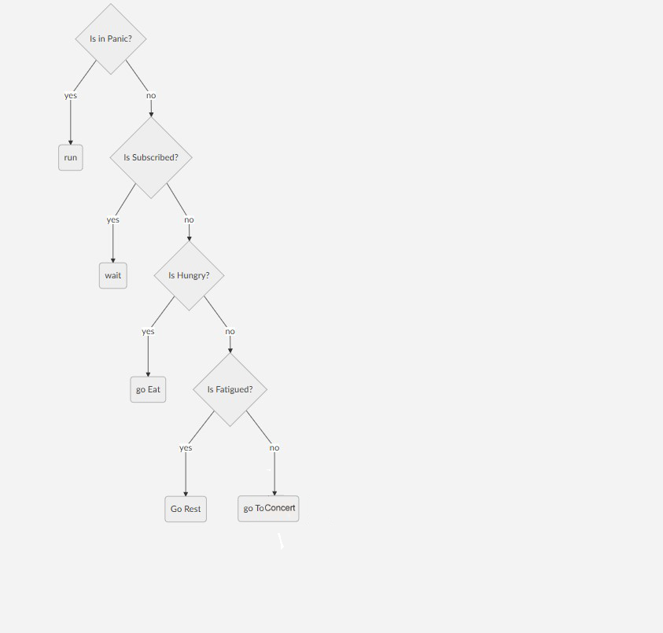

# Simulação de pânico em multidões com IA
   Este projeto foi realizado por Pedro Oliveira (a21705187) para a disciplina de Inteligência artificial do curso de Videojogos da universidade Lusofona.
   
# Introdução

Este projeto é uma tentativa de simular de maneira simples o comportamento de Pânico em multidões dentro de ambientes fechados. 

### Pânico em multidões
   Como referenciado em "*Proposing a Cognitive Multi-agent Model for the Panic in Crowds Phenomenon*" [1]
"... *The social contagion is an intense form of collective excitement, promoting a fast dissemination of the collectively formed representation, empowering the social cohesion and making room for a collective action. Now the shared ideas and feelings are amplified since an individual notices that the others also feel and think in a way similar of his, making a circular reaction. Finally, when the individuals have built a collective representation of the situation it is possible to choose and execute actions. At this moment, the collective crisis created by a struggle for survival comes to an apex, and the collective panic is installed.* ..." 

Em suma, o panico coletivo é gerado pelo insinto de sobrevivencia no qual em uma situação extrema o individuo deixa de pensar no grupo e age por conta própria no inutito de salvar sua vida, desencadeando uma reação em cadeia nos outros ao seu redor.

# Experimento

Foi produzido um ambiente fechado com 3 saídas, 2 palcos , 2 praças de alimentação e 2 zonas de descanso. Neste ambiente é adicionado um mínimo de 100 pessoas e então é iniciado uma explosão num ponto definido pelo utilizador.

 Com a explosão, os indivíduos pegos pela mesma morrem. Existe um raio de pânico e um raio de incapacitação gerado pela explosão que alerta as pessoas dentro do mesmo ou as incapacita, diminuindo a velocidade pela metade daqueles que foram pegos pelo raio.
Aqueles que são atingidos por uma das duas zonas entram num estado de pânico no qual propagam o mesmo para outras pessoas dentro de um certo perímetro ao entorno de si.

## Comportamento das entidades

As entidades baseiam-se no seguinte comportamento:

A *behaviour tree* é chamada no *fixed update*  para que seja com um tempo fixo, sem depender fo framerate.

## Explosões

Cada explosão tem três perímetros:
- O perímetro de explosão, que gera morte instantânea;
 - O perímetro de de choque, que causa a perda de metade do movimento;
- O perímetro de panico, que gera o estado de pânico nos individuos;
 
A explosão ainda gera um foco de incêndio, no qual se propaga constantemente, as pessoas em estado de pânico tentam correr para a saída mais próxima ao mesmo tempo que tentam se distanciar do fogo, aqueles que ainda não estavam no estado de pânico, ao entrarem num certo perímetro do fogo ativam o tal estado, tendo assim o mesmo comportamento dos demais. 
 
## Personagens

cada indivíduo tem um *scriptable object* no qual define suas caracteristicas entre 4 principais, *fat, thin, average, fit*, cada um tem seu próprio nivel de fome e cansaço bem como a velocidade que é perdido e recuperado os valores, são também separados por cor para melhor averiguação dentro do cenário.

## Cenário

Foi utilizado um cenário 3d, bem como o algoritmo A* com navmesh do Unity.
Foram demarcadas as areas de movimentação , repouso e de alimentação com o uso de tags e layers. para ser utilizado pelo sistema de navegação.

# Conclusão

Ao fazer algnus testes com o projeto, chega-se a conclusão que o mesmo ainda não tem informações o suficiente para ser utilizado como base de estudo para situações de pânico em multidões porém, é bem interessante de visualisar de maneira muito básica o comportamento dos indivíduos, que muitas vezes são empurrados para os cantos do cenário, ao levar em consideração que o fogo ao se alastrar muitas vezes acaba por bloquear as saídas, um comportamento que acontece varias vezes em situações de incêndio em lugares fechados.

# Referências

 "*Proposing a Cognitive Multi-agent Model for the Panic in Crowds Phenomenon*" https://www.researchgate.net/publication/261460840_Proposing_a_Cognitive_Multi-agent_Model_for_the_Panic_in_Crowds_Phenomenon
acessado em 25/06/2021

"*Pick random point inside box collider*"
https://forum.unity.com/threads/pick-random-point-inside-box-collider.541585/
acessado em 23/06/2021
